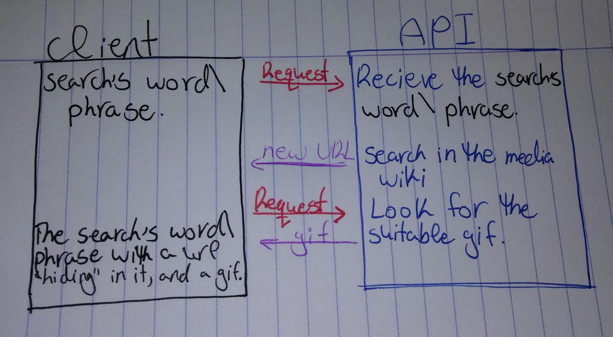

# MediaWikiGiphy
## By Jasmine, Aman, & Ahlam

## Link :   https://lotus-1.github.io/MediaWikiGiphy/

## Description:

### we build a simple web app that must query an API and use the result to update the DOM.
### Ask user's input for their technical stuff, then the program will navigate to the article, and a gif will appear on the browser.

## Technologies Used:
* ### HTML
* ### CSS
* ### Javascript
* ### json

## Suport and contact details:

### If you have any question or suggestions. please free to contact us.

## Emails:
* ###  Ahlam : ahlamkadour2016@gmail.com
* ### Jasmine : jasmineb2011@gmail.com
* ### Aman : amanhalabyar7@gmail.com

### And you can raise an issue on github if you have any comments related to code, style, or README.

## Thank you for visiting.
